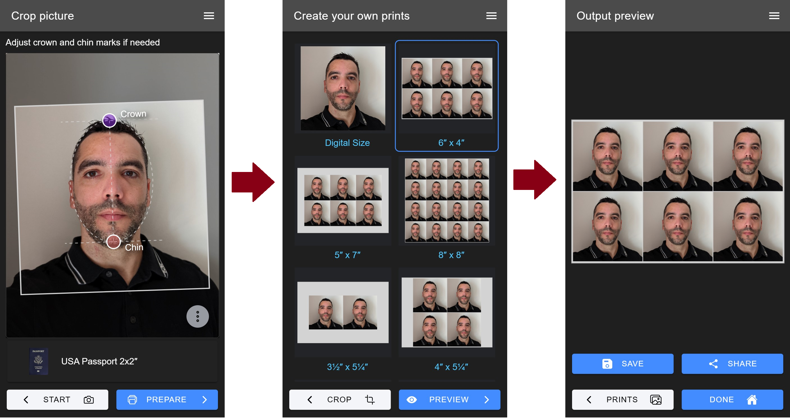

# [Photo ID Creator](https://myphotoidapp.firebaseapp.com/) - A tool to prepare photo IDs

This project implements a web-based application that creates photographs in compliance with many ID forms and documents such as passports, visas, licenses, etc. The application takes as input a photograph of a person's face and automatically applies resizing and rotation to comply with the specified photo requirement. Then, the user can generate a tiled photo for a given print format such as 4x6" or 5x7" and have it printed at home or at your nearest photo center.

<div style="text-align:center"></div>

## History of the project

I started this project several years ago with the dream of covering the gaps of existing web-based and Android/iOS apps that can produce valid photos for IDs and official applications. Being an immigrant, firstly in Australia, then in the USA, meant that I often found myself needing passport-sized photos for myself and my family members. Of course, this is a service that is offered in many places, but it is never cheap, especially for people starting from the ground up in a new country, possibly without a job, or with a large family. Traditional photo ID services also have the inconvenience of a trip to your nearest location. This is usually not a big deal, but what about parents with babies or people with disability or mobility problems?

Over the years, the tech stack I've used in this project has changed significantly, but the goal has always been the same: _provide_ a free client-side application that people can use to prepare their own photographs. Firstly, I always wanted it to be a tool where personal data (i.e. the user's photographs) never leave their PC or phone, unless they explicitly decide to print it online or share the result electronically. Secondly, I want the workflow to be _so_ simple that if you are capable of taking a picture of someone's face with your phone and know what type of document you need (e.g. a US Passport), the app should take care of the rest with just a couple of clicks.

Obviously, not all photos taken at home with a smartphone camera will have the quality to meet photo ID requirements, but if you are on the budget and/or have the time to ensure you capture a picture of yourself with good resolution, proper focus and illumination, then this app will do the maths to prepare an output tiled photo ready to be printed for much less than a dollar at your closest photo center.

## Tech stack of the application

The application is made out out two components, a C++ library compiled to WebAssembly and a front-end application developed using Ionic with Angular backend in TypeScript.

Image processing algorithms of the application are developed in modern C++ and compiled to WebAssembly with Emscripten. The C++ code lives inside folder `libppp` and is built using [Bazel](https://bazel.build/). Originally, all C++ code was building with [CMake](https://cmake.org/), but since the app now uses [MediaPipe](https://developers.google.com/mediapipe/solutions), it only made sense to move the build system to Bazel given the complexities of porting MediaPipe to a CMake-based build system.

Libraries used in C++:

- OpenCV (core, imgproc, imgcodecs, objdetect, etc.)
- MediaPipe and its dependencies (TensorFlow Lite)
- Google Test

The front-end of the application is built using

- Ionic Framework with Angular
- Interact.js (for gesture processing)
- ngx-color-picker (color picker component)
- flag-icons (icons of country flags)

## Getting started with the code

You'll need a POSIX system with Docker and bash available (WSL2, Linux or Mac). See section [Installing WSL2 on Windows](#Installing-WLS2-on-Windows) if you need help setting it up.

Then, either you install NPM or run the following by opening the folder in VSCode using DevContainers.

```bash
npm run wasm:all

# To start the app
cd webapp && npm install && npm start
```
### Installing WLS2 on Windows

To setup WSL2 with docker, run the following steps in a Powershell or CMD as Administrator.

```batch
:: Check for wsl updates
wsl --update

:: Install Ubuntu 22.04
wsl --install Ubuntu-22.04
```

Now inside WSL install docker and exit:

```bash
echo $(whoami) ALL=\(root\) NOPASSWD:ALL | sudo tee /etc/sudoers.d/$(whoami)
printf '[boot]\nsystemd=true\n' | sudo tee /etc/wsl.conf
sudo apt-get update
sudo apt-get install apt-transport-https ca-certificates curl software-properties-common
curl -fsSL https://download.docker.com/linux/ubuntu/gpg | sudo apt-key add -
sudo add-apt-repository "deb [arch=amd64] https://download.docker.com/linux/ubuntu $(lsb_release -cs) stable"
sudo apt-get update
sudo apt-get install docker-ce -y
sudo usermod -aG docker $USER
sudo service docker start
sudo reboot
```

If everything worked well, then you should be able to run in CMD or Powershell:

```bash
wsl -d Ubuntu-22.04 docker run hello-world
```

If you want to do Typescript/Javascript development directly on Windows, install Node.js and NPM on Windows. With Powershell this can be achieved via `winget install OpenJS.NodeJS.LTS --accept-source-agreements`.


## Algorithm in a nutshell

In order to crop and scale the face of the person to a particular passport requirement, the following approach was investigated. Given the set of detected face landmarks *A*, *B*, *C* and *D*, we would like to estimate *P* and *Q* with an accuracy that is sufficient to ensure that the face in the output photo fall within the limits of the size requirements. In other words, the estimated location of the crown (*P’*) and chin point (*Q’*) should be such that the distance *P’Q’* scaled by the distance between the ideal location of the crown (*P*) and chin point (*Q*) falls within the tolerance range allowed in the passport specifications. For instance, in the case of the Australian passport, the allowed scale range is **±5.88%** for a face height between 32 and 36mm: [(36mm - 32mm)/(36mm + 32mm)]

To develop and validate the proposed approach, facial landmarks from the [SCFace database](http://www.scface.org/) were used. The SCFace database contains images for 130 different subjects and frontal images of each individual were carefully annotated by the [Biometric Recognition Group - ATVS at Escuela Politecnica Superior of the Universidad Autonoma de Madrid [ATVS]](https://atvs.ii.uam.es/scfacedb_landmarks.html).
The procedure to estimate *P’* and *Q’* from *A*, *B*, *C* and *D* is as follow: Firstly, points *M* and *N* are found as the center of segments *AB* and *CD* respectively. *P’* and *Q’* are expected to fall in the line that passes through *M* and *N*. Then using a normalization distance *KK = |AB| + |MN|* and scale constants *α* and *β*, we estimate *P’Q’* = *αKK* and *M’Q’* = *βKK*. From the dataset *α* and *β* were adjusted to minimize the estimation error of *P'* and *Q'*.

<div style="text-align:center"></div>

### Update

In a second iteration, the algorithm to detect facial landmarks has been substituted by a face alignment algorithm proposed by Vahid Kazemi 2014: [One Millisecond Face Alignment with an Ensemble of Regression Trees](http://www.csc.kth.se/~vahidk/face_ert.html). An implementation of the algorithm is available in [dlib C++ library](http://dlib.net/). This library ships with a model capable of detecting 68 landmarks, but has a compressed size of ~ 61MB. This is large enough to become a problem when packing an Android application to be deployed at Google Play store or to serve it on a web application that does client side processing (like we do with WebAssembly). Because of that, I have retrained the model to detect only 28 landmarks of the original set. This reduced the model size to 16.9MB when compressed, which can still be considered large to serve on a web application, but not prohibitive.

## How to run it

This application is currently provided in two forms: As a command line utility or as a [Firebase web app](https://myphotoidapp.firebaseapp.com/) fully running on the browser (i.e. backend only serves static files). The web app can also be built and run on Android using [Ionic capacitor](https://capacitor.ionicframework.com/), but this is still not well supported. The software is fully cross-platform, written in C++ and TypeScript, and has been built on Windows 10 with Visual Studio 2015 and 2017, Linux Mint with GCC 8.x and Mac with Clang 7.0. Non C++17 compliant compilers can also be used, but boost/filesystem is needed to build and run C++ unit tests.

### Prerequisites you'll need to install yourself

- CMake 3.12 or higher
- Python 2.7+ (build scripts)

#### If you are building the command line application

- A C++17 compliant compiler: On Windows use Microsoft Visual C++ 2017. On Mac LLVM 7.x. On Linux GCC 8.x

#### If you are building the web application only

- node.js 10.x and NPM


### Building the Android application

```batch
python build.py -a wasm web android
```

### Generating a Visual Studio project/solutions for C++ development

```batch
python build.py --gen_vs_sln -bdebug
```

## Building the Android App on a Debian based Linux OS

sudo add-apt-repository ppa:webupd8team/java
sudo apt-get update
sudo apt-get install oracle-java8-installer
sudo apt install oracle-java8-set-default
sudo apt-get install libpcap0.8-dev


