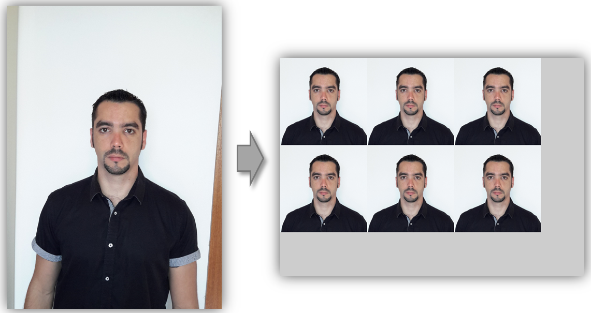

# Passport photo app  

---  

Recruiters please read [here](https://github.com/dpar39/ppp/wiki/Recruiters-README) for information on the skills demonstrated in this project.

This app allows users to create passport photo prints with automatic picture size and rotation cropped to comply with the standards accepted in most countries. Users get a tiled photo in your favorite print format (e.g. 4"x6" or 5"x7") with the appropriate resolution ready be printed.

The main motivation for this app is how expensive passport photo services can be in many countries. For instance, OfficeWorks in Australia currently charges [$14.95](http://www.officeworks.com.au/print/print-and-copy/print-services/passport-and-id-photo) for four passport photos. Walgreens near my home charged me [$13.99](https://photo.walgreens.com/walgreens/pdpsdpitems/type=passport_photos) for only two a few weeks ago. Obviously, not all photos taken at home with a smartphone camera will have the quality to meet the standards, but if you are on the budget and/or have the time to ensure you capture a picture of yourself with good resolution, proper focus and low noise, then this app will do the maths to prepare an output tiled photo ready to be printed for less than a dollar at your closest photo center.

# Installation
The software can be built and run in either Windows or Unix based operating systems.

## Dependencies (OS Indepent)
- Python 2.7 or higher
- CMake 3.0 or higher

### Windows-specific dependencies
- Visual Studio 2012, 2013 or 2015
- In Windows, Node.js is built from source and the C++ addon is built and linked with CMake

### Linux-specific dependencies
- gcc toolchain
- Node.js 4.x
- Node-gyp (needed to compile the C++ addon)

## Compiling and running
At the moment, the web app is still under construction, but the Node.js addon that does the heavy lifting can alredy be used to generate passport photos from the command line:

- Clone this repository somewhere in your computer. Then run scripts _build.linux64.sh_ or _build.win64.bat_ depending on your platform. This will take a while because third party libraries such as _OpenCV_, _Poco_ and _GMock_ are built from source code. If everything goes well the installation directory (e.g. install_release_x64) should contain the addon module (_addon.node_) and a script _test.js_.
- Edit _test.js_ and set the path of the input picture you would like to process. Feel free to edit the printing definition to your needs. By default, it is configured as per the [US Passport requirements](https://travel.state.gov/content/passports/en/passports/photos/photos.html) (2" x 2" with face length of 1.1875" and eyes to picture bottom distance of 1.25"). The output size is 4" x 6" with 300dpi resolution.
- Run a terminal and change directory to your install directory, then run _node_ _test.js_ and your print-ready photo will be created.

